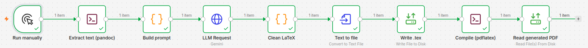

# Service Proposal Automation — n8n Workflow

> Local, self-hosted n8n workflow that turns an **AI Factory service proposal** (`.docx`)
> into a short **executive review** (`.pdf`) using **Gemini** + **LaTeX (Tectonic)**.

---

## Table of Contents

1. [Introduction](#1-introduction)
2. [What the workflow does (high level)](#2-what-the-workflow-does-high-level)
3. [Why self-hosted n8n](#3-why-self-hosted-n8n)
4. [Prerequisites](#4-prerequisites)
5. [Host dependencies: pandoc and Tectonic](#5-host-dependencies-pandoc-and-tectonic)
6. [Docker: the exact command, explained flag by flag](#6-docker-the-exact-command-explained-flag-by-flag)
7. [Volumes and environment variables reference](#7-volumes-and-environment-variables-reference)
8. [First launch: opening n8n on localhost](#8-first-launch-opening-n8n-on-localhost)
9. [Creating the Gemini API credential](#9-creating-the-gemini-api-credential)
10. [Importing the workflow JSON](#10-importing-the-workflow-json)
11. [Folder structure inside the container](#11-folder-structure-inside-the-container)
12. [Node-by-node explanation (what and why)](#12-node-by-node-explanation-what-and-why)
13. [End-to-end user pipeline (the everyday routine)](#13-end-to-end-user-pipeline-the-everyday-routine)
14. [Where the generated file lives and how to copy it out](#14-where-the-generated-file-lives-and-how-to-copy-it-out)
15. [Troubleshooting](#15-troubleshooting)
16. [Maintenance notes](#16-maintenance-notes)

---

## 1. Introduction

This project is a **self-hosted n8n workflow** that automates the *executive review* of
AI Factory (BSC) service proposals.

You drop a proposal written in Microsoft Word (`.docx`) into a shared folder, run the
workflow, and n8n:

1. extracts the text from the `.docx`,
2. sends it to a large language model (**Google Gemini 2.5 Flash**) acting as a
   *Senior AI Engineer reviewer*,
3. receives a concise review written directly as a **LaTeX** document,
4. compiles that LaTeX into a polished **PDF**,
5. leaves the PDF ready to be read / copied out of the container.

Everything runs **locally** on your machine inside a single Docker container. No proposal
text ever leaves your machine except the single API call to Gemini.

The full pipeline looks like this:

```
Run manually
  → Extract text (pandoc)
    → Build prompt
      → LLM Request (Gemini)
        → Clean LaTeX
          → Text to file
            → Write .tex
              → Compile (Tectonic)
                → Read generated PDF
```

And, as it looks in the n8n editor:



> **Naming note:** the compile node is still labelled **"Compile (pdflatex)"** in the UI
> for historical reasons, but it actually runs **Tectonic** (see
> [§15](#15-troubleshooting) for why we migrated away from `pdflatex`).

---

## 2. What the workflow does (high level)

| Stage | Tool | Result |
|-------|------|--------|
| Read the proposal | `pandoc` | Plain text extracted from `.docx` |
| Assemble the instruction | JS Code node | A full prompt (system role + proposal + strict LaTeX template) |
| Generate the review | Gemini 2.5 Flash | A raw LaTeX document as text |
| Sanitise the output | JS Code node | Clean, validated LaTeX string |
| Persist + compile | Tectonic | A `.pdf` on disk |
| Deliver | readWriteFile | PDF available inside the container |

The AI is constrained to produce **2–5 short, high-impact recommendations**, never longer
than 2 pages, and to output **only** a self-contained LaTeX document (no markdown, no chatter).

---

## 3. Why self-hosted n8n

We run n8n **self-hosted (community edition) in Docker** instead of using n8n Cloud for
several concrete reasons:

- **Data locality / confidentiality.** Service proposals are internal BSC documents. With
  self-hosting, the `.docx` files, the extracted text, and the generated PDFs live only on
  your machine. The only external call is the Gemini API request.
- **Local binaries.** The workflow depends on command-line tools (`pandoc`, `tectonic`)
  that must be reachable by n8n's `Execute Command` nodes. Self-hosting lets us mount those
  binaries directly into the container. This is impossible on n8n Cloud.
- **Filesystem access.** The workflow reads and writes real files (`.tex`, `.pdf`) on disk.
  This requires the `Read/Write Files from Disk` nodes, which only work with a filesystem we
  control.
- **No recurring cost / full control.** Everything is free and reproducible from this README.

---

## 4. Prerequisites

On the **host machine** (a Linux workstation, e.g. `/home/mclapers`) you need:

- **Docker** installed and running (`docker --version`).
- Internet access (n8n pulls its image; Gemini and Tectonic need network at runtime).
- A **Google AI Studio / Gemini API key** (for the LLM Request node).
- The two CLI binaries described in the next section: **pandoc** and **Tectonic**.

Check Docker is available:

```bash
docker --version
docker ps
```

---

## 5. Host dependencies: pandoc and Tectonic

The n8n image is based on **Alpine Linux (musl libc)**. This matters: any binary you mount
into the container must be compatible with musl, **not** glibc. This is exactly why the
original `pdflatex` approach failed (see [§15](#15-troubleshooting)) and why we use
**Tectonic**, which ships a fully static musl binary.

### 5.1 pandoc

Download a pandoc release and keep the binary somewhere stable in your home directory. For
example, using version `3.1.11`:

```bash
cd ~
wget https://github.com/jgm/pandoc/releases/download/3.1.11/pandoc-3.1.11-linux-amd64.tar.gz
tar xzf pandoc-3.1.11-linux-amd64.tar.gz
# The binary is now at: ~/pandoc-3.1.11/bin/pandoc
~/pandoc-3.1.11/bin/pandoc --version   # sanity check
```

We will mount `~/pandoc-3.1.11/bin/pandoc` into the container in the next section.

### 5.2 Tectonic (LaTeX engine)

Tectonic is a **single, self-contained, statically linked** LaTeX engine. It has **no
external library dependencies**, so it runs cleanly inside the Alpine/musl n8n container —
unlike a host `pdflatex` compiled for glibc.

Download the **x86_64 musl** build (replace the version with the latest release tag):

```bash
cd ~
# Example version — check https://github.com/tectonic-typesetting/tectonic/releases for the newest
wget https://github.com/tectonic-typesetting/tectonic/releases/download/tectonic%400.15.0/tectonic-0.15.0-x86_64-unknown-linux-musl.tar.gz
tar xzf tectonic-0.15.0-x86_64-unknown-linux-musl.tar.gz
# The binary is now at: ~/tectonic
~/tectonic --version   # sanity check
chmod +x ~/tectonic
```

> **First-run behaviour:** on the very first compile, Tectonic downloads the TeX support
> bundle it needs and caches it. This means **the container needs internet access the first
> time you run the compile node**. Subsequent runs use the cache. See
> [§16](#16-maintenance-notes) for how to persist that cache across container restarts.

---

## 6. Docker: the exact command, explained flag by flag

This is the command that creates and starts the container. Run it **once**. Adjust the
binary paths (`~/pandoc-3.1.11/bin/pandoc`, `~/tectonic`) to wherever you placed them.

```bash
docker run -d \
  --name n8n \
  -p 5678:5678 \
  --add-host=host.docker.internal:host-gateway \
  -e GENERIC_TIMEZONE="Europe/Madrid" \
  -e TZ="Europe/Madrid" \
  -e N8N_RESTRICT_FILE_ACCESS_TO="/files" \
  -e NODE_FUNCTION_ALLOW_EXTERNAL="*" \
  -e NODES_EXCLUDE="[]" \
  -v n8n_data:/home/node/.n8n \
  -v n8n_files:/files \
  -v ~/pandoc-3.1.11/bin/pandoc:/usr/local/bin/pandoc:ro \
  -v ~/tectonic:/usr/local/bin/tectonic:ro \
  docker.n8n.io/n8nio/n8n
```

### What each part means

- **`docker run -d`** — run the container **detached** (in the background).
- **`--name n8n`** — name the container `n8n` so you can reference it later
  (`docker cp n8n:...`, `docker exec -it n8n sh`, etc.).
- **`-p 5678:5678`** — publish container port `5678` (n8n's web UI) to host port `5678`,
  so you can open it at `http://localhost:5678`.
- **`--add-host=host.docker.internal:host-gateway`** — lets processes inside the container
  reach services running on the host machine via the hostname `host.docker.internal`. Handy
  if you ever need the container to talk to something on your host.
- **`-e GENERIC_TIMEZONE` / `-e TZ`** — set the timezone so schedules and timestamps are
  correct (`Europe/Madrid`).
- **`-e N8N_RESTRICT_FILE_ACCESS_TO="/files"`** — **security setting.** It restricts the
  `Read/Write Files from Disk` nodes so they can only touch paths under `/files`. This is
  why every file path in the workflow starts with `/files/...`.
- **`-e NODE_FUNCTION_ALLOW_EXTERNAL="*"`** — allows Code nodes to `require()` external npm
  modules if ever needed. Not strictly required by this workflow, but harmless and part of
  the original setup.
- **`-e NODES_EXCLUDE="[]"`** — do not disable any node types (empty exclusion list).
- **`-v n8n_data:/home/node/.n8n`** — **named volume** persisting n8n's own state:
  workflows, credentials, encryption key, settings. Without this you lose everything on
  container recreation.
- **`-v n8n_files:/files`** — **named volume** that is the shared working area. Proposals
  and generated files live here. Mapped inside the container as `/files`.
- **`-v ~/pandoc-3.1.11/bin/pandoc:/usr/local/bin/pandoc:ro`** — mount the host pandoc
  binary read-only at a location on the container's `PATH`, so `pandoc ...` works in the
  Execute Command node.
- **`-v ~/tectonic:/usr/local/bin/tectonic:ro`** — same idea for Tectonic, so `tectonic ...`
  works in the compile node.
- **`docker.n8n.io/n8nio/n8n`** — the official n8n image (Alpine-based).

### Managing the container afterwards

```bash
docker ps                 # is it running?
docker logs -f n8n        # follow n8n logs
docker stop n8n           # stop it
docker start n8n          # start it again
docker restart n8n        # restart (e.g. after mounting a new binary)
docker rm -f n8n          # remove it (named volumes n8n_data / n8n_files survive)
```

> **Important:** if you add or change a `-v` mount (e.g. install Tectonic after the fact),
> you must **remove and recreate** the container (`docker rm -f n8n` then run the
> `docker run` command again). Mounts cannot be added to a running container. Your
> workflows and credentials survive because they live in the `n8n_data` volume.

---

## 7. Volumes and environment variables reference

### Volumes

| Mount | Type | Purpose |
|-------|------|---------|
| `n8n_data:/home/node/.n8n` | named volume | n8n internal state: workflows, credentials, encryption key |
| `n8n_files:/files` | named volume | Shared working folder for proposals + generated files |
| `~/pandoc-.../pandoc → /usr/local/bin/pandoc` | bind (ro) | pandoc CLI available inside container |
| `~/tectonic → /usr/local/bin/tectonic` | bind (ro) | Tectonic LaTeX engine available inside container |

### Environment variables

| Variable | Value | Why |
|----------|-------|-----|
| `GENERIC_TIMEZONE` | `Europe/Madrid` | Correct scheduling/timestamps |
| `TZ` | `Europe/Madrid` | OS-level timezone |
| `N8N_RESTRICT_FILE_ACCESS_TO` | `/files` | Confine file nodes to `/files` (security) |
| `NODE_FUNCTION_ALLOW_EXTERNAL` | `*` | Allow external modules in Code nodes |
| `NODES_EXCLUDE` | `[]` | Don't disable any node types |

---

## 8. First launch: opening n8n on localhost

1. Make sure the container is running: `docker ps` should list `n8n`.
2. Open your browser at:

   ```
   http://localhost:5678
   ```

   You can also click the link printed in `docker logs n8n` (n8n logs the local URL on
   startup — clicking it opens the editor).
3. On first run, n8n asks you to **create an owner account** (email + password). This is a
   **local** account stored in the `n8n_data` volume; it is not sent anywhere. Fill it in
   and continue.
4. You now see the n8n editor canvas. You're ready to import the workflow.

---

## 9. Creating the Gemini API credential

The **LLM Request** node calls the Gemini REST endpoint and authenticates with an HTTP
header. You must create the credential once.

1. Get a Gemini API key from Google AI Studio (`https://aistudio.google.com/app/apikey`).
2. In n8n, go to **Credentials → New → "Header Auth"** (generic HTTP header auth).
3. Fill in:
   - **Name:** `Gemini API` (any name; the workflow references it by the stored credential)
   - **Header Name:** `x-goog-api-key`
   - **Header Value:** *your Gemini API key*
4. Save.
5. Open the **LLM Request** node and, under **Credential for Header Auth**, select
   `Gemini API`.

> The node sends `Content-Type: application/json` plus the `x-goog-api-key` header. The
> request body is built as an **expression** (starts with `={{ ... }}`) and injects the
> prompt as `text: $json.prompt` — **no quotes** around `$json.prompt`, otherwise n8n sends
> the literal string instead of the value (see [§15](#15-troubleshooting)).

---

## 10. Importing the workflow JSON

1. In the n8n editor, click the **"⋯" menu (top-right) → Import from File**
   (or **Import from URL** if hosted).
2. Select `Service_Proposal_Automation.json`.
3. The canvas fills with the 9 nodes shown in the diagram (Run manually → … → Read
   generated PDF).
4. Open the **LLM Request** node and attach the `Gemini API` credential (imported workflows
   don't carry secrets).
5. Save the workflow.

---

## 11. Folder structure inside the container

All paths live under `/files` (because of `N8N_RESTRICT_FILE_ACCESS_TO=/files`):

```
/files/
└── service_proposals/
    ├── Service Proposal_Storydata.docx   ← the input proposal you drop in
    └── tmp/                               ← working + output folder
        ├── Service_Proposal_Storydata.tex   (generated LaTeX)
        ├── Service_Proposal_Storydata.pdf   (final review PDF)
        └── (Tectonic auxiliary files, if any)
```

- **Input** `.docx` goes in `/files/service_proposals/`.
- **Outputs** (`.tex`, `.pdf`, aux files) are written to `/files/service_proposals/tmp/`.

Create the `tmp` folder once if it doesn't exist:

```bash
docker exec -it n8n sh -c "mkdir -p /files/service_proposals/tmp"
```

---

## 12. Node-by-node explanation (what and why)

The workflow has **9 nodes**, executed left to right.

### 1. Run manually  *(Manual Trigger)*
Starts the workflow by hand from the editor (the **Execute Workflow** button). The workflow
is not active/scheduled — it is run manually while in use.

### 2. Extract text (pandoc)  *(Execute Command)*
Runs:
```bash
pandoc "/files/service_proposals/Service Proposal_Storydata.docx" -t plain
```
Converts the Word proposal into **plain text** on `stdout`. That text becomes `$json.stdout`
for the next node. *Why:* the LLM needs raw text, not a binary `.docx`.

### 3. Build prompt  *(Code)*
Assembles the full instruction sent to Gemini. It concatenates three parts:
- a **system prompt** defining the reviewer role (*Senior AI Engineer*, executive-level,
  2–5 recommendations, ≤ 2 pages, consultancy-only framing, AI Factory expertise areas);
- the extracted **proposal text** (`$json.stdout`);
- strict **LaTeX output instructions** with a fixed template (sections *Overall Assessment*,
  *Suggested Changes*, *Final Reviewer Recommendation*), demanding **only** a self-contained
  LaTeX document with no markdown or commentary.

It outputs `{ prompt, filename }`, where `filename = "Service_Proposal_Storydata"`.
*Why:* centralises all prompt logic and defines the base filename used downstream.

### 4. LLM Request  *(HTTP Request → Gemini)*
POSTs to:
```
https://generativelanguage.googleapis.com/v1beta/models/gemini-2.5-flash:generateContent
```
Body (expression):
```js
={{
  {
    contents: [ { parts: [ { text: $json.prompt } ] } ],
    generationConfig: { temperature: 0.2 }
  }
}}
```
Low temperature (0.2) for consistent, conservative output. Auth via the `x-goog-api-key`
header credential. *Why:* this is where the review is actually generated.

### 5. Clean LaTeX  *(Code)*
Takes Gemini's text from `candidates[0].content.parts[0].text` and:
- strips any ` ```latex ` / ` ``` ` code fences,
- trims to the substring between `\documentclass` and `\end{document}`,
- **validates** the result — if `\documentclass` or `\end{document}` is missing, it throws:
  `Response does not contain a valid LaTeX document. Received: ...`.

It passes `{ tex, filename }` forward. *Why:* LLMs sometimes wrap output in fences or add
chatter; this guarantees the `.tex` is clean and valid, and fails **loudly and early** with
a clear message instead of letting a broken file reach the compiler.

### 6. Text to file  *(Convert to File)*
Converts the `tex` string into an in-memory **binary file** named `review.tex`.
*Why:* the next node writes a binary file to disk; this produces that binary payload.

### 7. Write .tex  *(Read/Write Files from Disk)*
Writes the binary to:
```
/files/service_proposals/tmp/{{ $('Clean LaTeX').item.json.filename }}.tex
```
i.e. `Service_Proposal_Storydata.tex`. *Why:* Tectonic compiles a file on disk, so the
LaTeX must be materialised first. Note the explicit reference
`$('Clean LaTeX').item.json.filename` — the filename lives on the *Clean LaTeX* item, not on
the current node's `$json`.

### 8. Compile (pdflatex)  *(Execute Command — actually Tectonic)*
Runs:
```bash
cd /files/service_proposals/tmp && tectonic Service_Proposal_Storydata.tex
```
Tectonic compiles the `.tex` into `Service_Proposal_Storydata.pdf` in the same folder.
*Why Tectonic and not pdflatex:* see [§15](#15-troubleshooting) — a host `pdflatex` is
glibc-linked and breaks inside the Alpine/musl container; Tectonic is a static musl binary
with no external deps.

### 9. Read generated PDF  *(Read/Write Files from Disk)*
Reads:
```
/files/service_proposals/tmp/{{ $('Clean LaTeX').item.json.filename }}.pdf
```
back into n8n as binary, so you can preview/download it from the node's output panel. This
is the final node. *Why:* makes the finished PDF available inside n8n (and confirms the
compile succeeded).

---

## 13. End-to-end user pipeline (the everyday routine)

This is the day-to-day procedure for a new proposal.

### Step 1 — Put the `.docx` into the container's shared folder

If your source Word file is on the host (e.g. in `~/Documents`), copy it into the
`n8n_files` volume under `service_proposals/`, using the **exact filename the workflow
expects**:

```bash
docker cp "/home/mclapers/Documents/Service Proposal_Storydata.docx" \
  n8n:/files/service_proposals/Service\ Proposal_Storydata.docx
```

> The workflow's pandoc command has the input path hardcoded as
> `Service Proposal_Storydata.docx`. Either name your file exactly like that, or edit the
> path in the **Extract text (pandoc)** node (and the `filename` in **Build prompt**) to
> match a different name.

Verify it landed:

```bash
docker exec -it n8n sh -c "ls -la /files/service_proposals/"
```

### Step 2 — Run the workflow

1. Open `http://localhost:5678`.
2. Open the **Service Proposal Automation** workflow.
3. Click **Execute Workflow** (the Manual Trigger).
4. Watch each node turn green. The **Read generated PDF** node's output shows the finished
   PDF binary.

### Step 3 — Copy the generated PDF out of the container to your machine

The PDF is created inside the container at
`/files/service_proposals/tmp/Service_Proposal_Storydata.pdf`. Copy it to a host folder:

```bash
mkdir -p /home/mclapers/Documents/n8n_test
docker cp n8n:/files/service_proposals/tmp/Service_Proposal_Storydata.pdf \
  /home/mclapers/Documents/n8n_test/
```

Open it:

```bash
xdg-open /home/mclapers/Documents/n8n_test/Service_Proposal_Storydata.pdf
```

Sanity-check it isn't 0 bytes (0 bytes = compile silently produced nothing):

```bash
ls -la /home/mclapers/Documents/n8n_test/Service_Proposal_Storydata.pdf
```

### Step 4 — (Optional) Clean up the container's temp files

To keep `tmp/` tidy between runs, remove the generated artefacts inside the container:

```bash
docker exec -it n8n sh -c "rm -f /files/service_proposals/tmp/Service_Proposal_Storydata.*"
```

Or wipe the whole `tmp` folder contents:

```bash
docker exec -it n8n sh -c "rm -f /files/service_proposals/tmp/*"
```

You may also want to remove the input `.docx` you copied in:

```bash
docker exec -it n8n sh -c "rm -f '/files/service_proposals/Service Proposal_Storydata.docx'"
```

---

## 14. Where the generated file lives and how to copy it out

| What | Path |
|------|------|
| Inside container — LaTeX source | `/files/service_proposals/tmp/Service_Proposal_Storydata.tex` |
| Inside container — final PDF | `/files/service_proposals/tmp/Service_Proposal_Storydata.pdf` |
| On host — where you copy it | `/home/mclapers/Documents/n8n_test/` |

Because `/files` is the **named volume `n8n_files`** (managed by Docker), the files are not
in an ordinary desktop folder. To reach them you either:

- **Copy them out** with `docker cp` (recommended, shown above), **or**
- **Inspect the volume path** on the host:
  ```bash
  docker volume inspect n8n_files
  ```
  Look at the `Mountpoint` (typically `/var/lib/docker/volumes/n8n_files/_data`). On Linux
  you can browse it directly (may need `sudo`). On Docker Desktop for Mac/Windows this lives
  inside the Docker VM and is not directly browsable — use `docker cp`.

> **Tip:** if you check outputs constantly, replace the named volume with a **bind mount**
> to a real host folder by using `-v ~/n8n-files:/files` in the `docker run` command. Then
> everything under `/files` appears directly in `~/n8n-files` with no copying. This requires
> recreating the container.

---

## 15. Troubleshooting

Real issues encountered while building this workflow, and their fixes.

### `libkpathsea.so.6: No such file or directory` when compiling
**Cause:** a host `pdflatex` binary (compiled for glibc/Debian) was mounted into the
Alpine/musl n8n container; the dynamic libraries don't match.
**Fix:** use **Tectonic** instead — a static musl binary with no external deps. Mount
`~/tectonic → /usr/local/bin/tectonic:ro` and call `tectonic file.tex`. (This is why the
node is still named "Compile (pdflatex)" but runs Tectonic.)

### `LaTeX Error: Missing \begin{document}` / compile fails on line 1
**Cause:** the `.tex` file didn't contain a real LaTeX document — usually because the LLM
returned plain text (e.g. `Hello.`) rather than LaTeX.
**Fix:** the **Clean LaTeX** node now validates the output and throws early:
```js
if (text.indexOf('\\documentclass') < 0 || text.indexOf('\\end{document}') < 0) {
  throw new Error('Response does not contain a valid LaTeX document. Received: ' + text.substring(0, 100));
}
```
If you see this error, read the "Received:" text — it tells you what the model actually
returned.

### Gemini responds with something unrelated; `promptTokenCount` is tiny (e.g. 4)
**Cause:** the HTTP Request body sent the **literal string** `"$json.prompt"` instead of the
prompt value. In n8n expressions, `$json.prompt` must be **unquoted** inside an `={{ }}`
block.
**Fix:** the body must be:
```js
={{
  { contents: [ { parts: [ { text: $json.prompt } ] } ], generationConfig: { temperature: 0.2 } }
}}
```
Confirm the fix by re-running and checking that `promptTokenCount` jumps to hundreds/thousands.

### `filename` is undefined in later nodes
**Cause:** `filename` is produced upstream and does not exist on the current node's `$json`.
**Fix:** reference it explicitly, e.g. `$('Clean LaTeX').item.json.filename` (as the Write
`.tex`, Compile, and Read PDF nodes already do).

### Tectonic hangs or errors on first run with no network
**Cause:** Tectonic downloads its TeX bundle on first use.
**Fix:** ensure the container has internet the first time. See [§16](#16-maintenance-notes)
to persist the cache.

### PDF is 0 bytes
**Cause:** compile produced no output (bad LaTeX that still "halted recoverably", or wrong
path).
**Fix:** check the Compile node's stdout/stderr, open the `.tex` in `tmp/`, and confirm it's
valid LaTeX.

---

## 16. Maintenance notes

- **Changing the input filename:** update both the path in **Extract text (pandoc)** and the
  `filename` constant in **Build prompt** so they stay consistent (the base name flows all
  the way to the PDF).
- **Changing the model:** edit the URL in **LLM Request** (e.g. swap `gemini-2.5-flash` for
  another Gemini model). Keep the same request/response shape.
- **Persisting Tectonic's cache** (avoid re-downloading the TeX bundle each container
  recreate): add a volume for the cache, e.g. `-v n8n_tectonic_cache:/home/node/.cache`,
  then recreate the container.
- **Adding/altering mounts** always requires `docker rm -f n8n` + re-running `docker run`.
  Your workflows and credentials persist in the `n8n_data` volume.
- **The workflow is not active** (`"active": false`) — it is meant to be run manually from
  the editor. To automate it (e.g. watch a folder), replace the Manual Trigger with an
  appropriate trigger node.
- **Backups:** to back up everything, back up the two Docker volumes `n8n_data` (workflows +
  credentials) and `n8n_files` (proposals + outputs).

---

*Workflow: **Service Proposal Automation** — 9 nodes, manual trigger, local Docker,
Gemini 2.5 Flash + Tectonic. Generates a ≤2-page executive review PDF from a `.docx`
proposal.*
